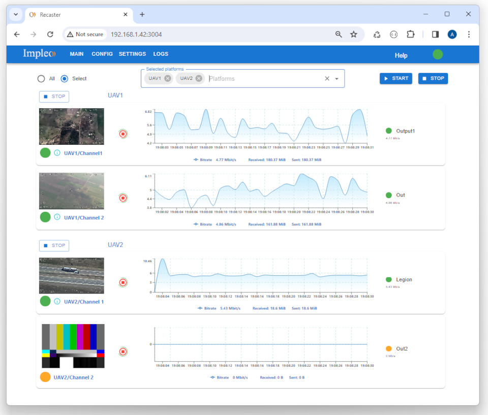

<div align="center">
  <a >
    
  </a>
</div>

# Recaster

  


## System Requirements

OS: Linux, Windows


## Direct Download link

|          | Version             | Download link                                                           | 
|:---------|:-------------------:|:------------------------------------------------------------------------|
| **Recaster for Windows (7z)** |  v2.7.0 | [recaster-install-win.7z](https://github.com/impleotv/recaster-release/releases/download/v2.7.0/recaster-install-win.7z)  | 
| **Recaster for Linux (tar.gz)** |  v2.7.0 | [recaster-install-linux.tar.gz](https://github.com/impleotv/recaster-release/releases/download/v2.7.0/recaster-install-linux.tar.gz)  | 

*Released on Sun, 25 Feb 2024, 09:15 GMT+2*


The installation and configuration instructions can be found [here](https://impleotv.com/content/recaster/help/).

> Note: To enable video preview functionality, GStreamer must be installed. The Docker image includes GStreamer pre-installed, eliminating the need for additional installations.

## Docker

Use the docker-compose.yml file that accompanies the release, or use the following command to run the Docker image:

```sh
docker run -d \
    --name recaster \
    --restart always \
    -e PORT=5000 \  
    -v $(pwd)/data/:/recaster/data/ \
    -v recasterdb:/recaster/db/ \
    -v recasterlic:/recaster/licenses/ \
    --network host \
    impleo/recaster:v2.7.0
```

More info [here](https://impleotv.com/content/recaster/help/user-guide/running-docker.html)

## Known issues:


----  
*Please don't hesitate to contact us at support@impleotv.com should you have any question.*
